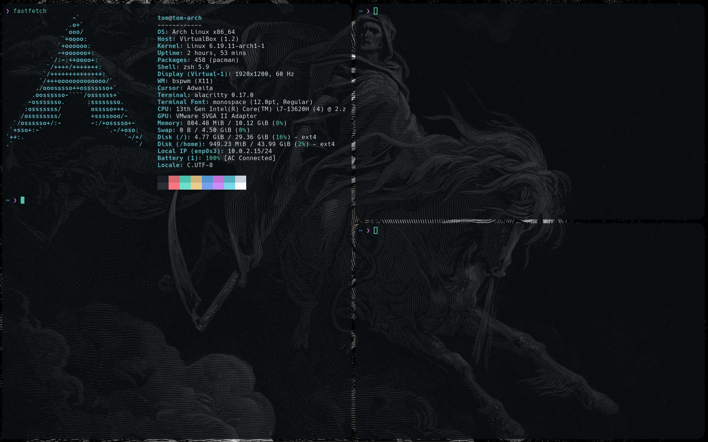

# Minimal Arch Linux on Oracle VirtualBox ௹

This is my workflow for hacking. Previously, I used `Kali-minimal`, and honestly, the differences are minimal.




### Minimal recommendations:

```javascript
RAM (Base Memory): 4 GB
Disk: 50 GB
Processors: 3
Acceleration: Nested Paging, KVM Paravirtualization (If you are on Linux, you can use QEMU + KVM — it is much better).
Video Memory: 75 MB

```

### Disk partitioning:

I use the following structure:

- `/boot` or `/boot/efi` (≤ 512 MB)
- `/` (root) (30 GB)
- `/home` (45 GB)
- `swap` (4–8 GB depending on RAM)

For Arch, I use `cfdisk` and select GPT. Even in a VM, GPT is more modern than DOS, but you can choose either.

After creating the partitions, format them:

```bash
mkfs.vfat -F 32 /dev/sda1   # EFI
mkfs.ext4 /dev/sda2         # root
mkfs.ext4 /dev/sda3         # home
mkswap /dev/sda4
swapon /dev/sda4
```

Partition layout:

| Partition | Filesystem | Size  |
|----------|-----------|------|
| /boot    | FAT32 (EFI) | 512 MB |
| /        | ext4      | 30 GB |
| /home    | ext4      | 45 GB |
| swap     | swap      | 4 GB  |

### Mount partitions:

```bash
mkdir -p /mnt/{boot,home}
mount /dev/sda2 /mnt
mount /dev/sda1 /mnt/boot
mount /dev/sda3 /mnt/home

pacstrap -K /mnt linux linux-firmware base base-devel grub efibootmgr wpa_supplicant networkmanager
```

### Package explanation:

- **linux:** The Linux kernel.
- **linux-firmware:** Firmware for GPU, network, sound, etc.
- **networkmanager:** Manages network connections (Wi-Fi, Ethernet, VPN).
- **wpa_supplicant:** Handles WPA/WPA2 Wi-Fi authentication.
- **grub:** Bootloader that loads the kernel.
- **efibootmgr:** Registers the boot entry in UEFI firmware.
- **base / base-devel:** Essential tools (bash, grep, make, gcc, etc.), useful for building software and AUR.

---

### FSTAB (important):

`fstab` is a configuration file that tells the system **which partitions to mount automatically at boot and where**.

You generate it with:

```bash
genfstab -U /mnt >> /mnt/etc/fstab
```

What it does:
- Detects your partitions
- Uses UUIDs (safer than `/dev/sdX`)
- Defines mount points (`/`, `/home`, `/boot`, etc.)

Example:

```bash
UUID=xxxx-xxxx / ext4 defaults 0 1
UUID=yyyy-yyyy /home ext4 defaults 0 2
UUID=zzzz-zzzz /boot vfat defaults 0 2
```

Without `fstab`, your system will not know how to mount disks on boot.

---
Now we use :arch-chroot /mnt (This is the main partition, Where installed the kernel linux).
 
You can now do most of the operations available from your existing installation.

Now we're able to entry in us system: `arch-chroot /mnt` for install the grub and create the user's.

```bash
user add -m "user"
usermod -aG wheel "user" (Wheel is a special grup for make able to the user be root).
passwed user, passwd = 18733user
```
Also here in this point we can put us hostname: `echo "Arch" > /etc/hostname`.

And now we goint to install the grub: 

bash```
grub-install --target=x84_64-efi --efi-directory=/boot --bootloader-id=Grub
grub-mkconfig -O /boot/grub/grub.cfg
```
And... Now we need to reboot the system, and if everything is ok we will see the grub and choose: `Arch linux`, and see the user that was creating and login, and for the internet, we need to creat symbolic links to up the services everytime that we power the system: `systemctl enable NetworkManager.service` and `systemctl enable wpa_supplicant.service` as well.

With that we already have us OS Arch linux. And we can install teh AUR repositorys that isn't officially for the Arch but is supported and maintened for the community so:

```bash
git clone https:/aur.archlinux.org/paru.git (Local compilation) For my is better less problems in my experience than 'paru-bin'.
cd /paru
make -si
```

And also if we want to more tools we can use the black arch repository:

```bash
curl -O https://balckarch.org/strap.sh 
chmod +x strap.sh
sudo ./strap.sh
```

And with that you, you have Arch linux, now I choose this for the setup:

### Tiling Window Manager:

BSPWM + SXHKD

- Terminal: Alacritty
- Picom
- Neovim
- bat (alias for cat)
- lsd (alias for ls)
- powerlevel10k (Zsh theme)
- Shell: zsh
- rofi (launcher)
- VirtualBox Guest: VBoxClient --clipboard
